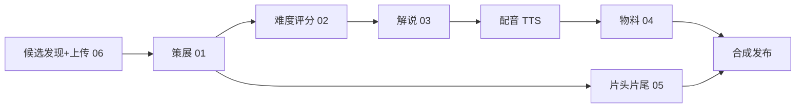

# bestdancer

「本周热舞」——面向跳舞初学者的 AI 热舞推荐与教学解说栏目。

## 定位

每周精选本周热门编舞 **TOP5**，外加 1 支「经典回归」旧舞；由 AI 生成教学解说（动作分解 + 难度星级）与年轻女声配音，首发 **抖音 / 小红书**。

### 长期愿景：全平台热舞榜单

BestDancer 的目标不是某一个平台的热舞搬运或单站热榜，而是一个以**同一套策展标准**横向比较的「全平台热舞榜单」：从抖音、小红书、Instagram、TikTok、Bilibili、YouTube 等平台发现当周候选，统一记录发布时间、热度、作者、链接和舞种；经过人工细筛、去重和难度编排后，产出面向中文初学者的周榜内容。

榜单的核心是**跨平台策展，而不是把各平台数据机械相加**。平台原生热度口径不一致，当前阶段保留来源平台与原始指标，按平台自身的可用筛选条件粗筛，再由编辑完成最终比较和排序。

**这是推荐 + 教学，可以下载少量的视频内容**：只要保留原作者水印，署名并附原链接即可。合规红线详见 [prompts/00-variables.md](prompts/00-variables.md)。

## 每期流程

1. **候选发现 & 上传**（[06](prompts/06-trend-brief.md)）：抖音 / 小红书反爬时不自动抓取——把热门候选链接 / 热榜丢给助理整理成清单，按 `<id>__<source>__<slug>.mp4` 命名下载到 `assets/incoming/<week>/`，跑 `python pipeline/intake.py <week>` 入库。经典回归从自有旧舞库（`classics_pool`）选。
2. **策展**（[01](prompts/01-curation.md)）：选 TOP5，排难度梯度，选 1 支经典回归。
3. **难度评分**（[02](prompts/02-difficulty-rubric.md)）：按 5 维 rubric 打分 → 1–5 星。
4. **教学解说**（[03](prompts/03-narration.md)）：每支 3–5 句（介绍 + 动作分解 + 适配建议）。
5. **配音**：年轻女声 TTS。
6. **发布物料**（[04](prompts/04-metadata.md)）：抖音 + 小红书 各自的标题 / 正文 / 封面 / 话题。
7. **合成**：片头 / 转场 / 片尾 / 经典回归卡（[05](prompts/05-intro-outro.md)）+ 星级角标 + 字幕。



## 目录结构

```
bestdancer/
├── README.md
├── .gitignore
├── prompts/                    # 各环节 prompt 模板(用 {变量} 占位)
│   ├── 00-variables.md         # 全局变量 + 合规红线(单一真源)
│   ├── 01-curation.md          # 策展/排序 + 经典回归
│   ├── 02-difficulty-rubric.md # 难度 1-5 星评分
│   ├── 03-narration.md         # 教学解说
│   ├── 04-metadata.md          # 抖音 + 小红书 发布物料
│   ├── 05-intro-outro.md       # 片头/转场/片尾 AI 生成
│   └── 06-trend-brief.md       # 候选发现/清单(人工上传版)
├── pipeline/
│   └── intake.py               # 扫描上传目录 -> 回填周配置候选
├── config/
│   └── weekly/                 # 每期一个 JSON(见 2026-W29.example.json)
└── assets/
    └── incoming/<week>/        # 人工下载的片段(命名 <id>__<source>__<slug>.mp4;被 gitignore)
```

## 状态

🚧 已具备本地后台、周工作区、抖音关注页发现/人工下载、Instagram/TikTok 关键词发现和统一候选池；小红书公开搜索登录态与各平台下载器仍在接入中。后续计划见 [TODO.md](TODO.md)。

## 本地管理后台

本地工作台将每周采集、人工策展和成片生成收拢到一个页面，并直接读写
`config/weekly/<week>.json`：

```bash
source .venv/bin/activate
python3 admin/app.py
```

打开 `http://127.0.0.1:8787` 后，按以下顺序操作：

1. 在顶部选择制作周次与最近周数；在“发现规则”勾选本期平台、按行配置关键词，并选择发布时间、热度与视频条件。启动粗筛前，Chrome 需以 `--remote-debugging-port=9222` 启动并完成对应公开站的登录。
2. 点击“开始粗筛（不下载）”：抖音从 `https://www.douyin.com/follow` 发现候选；Instagram、TikTok、小红书按关键词搜索。TikTok 会先切换原生「视频」分类，后台再按可读取的发布时间和点赞数筛选并排序。各平台结果统一进入候选池，并始终保留来源链接与平台标识。
3. 点击“同步粗筛 / 下载状态”，然后在候选表中人工校正舞种、名称、作者、星级和口播文案；舞种可选 `Hip-hop`、`Urban`、`Jazz`、`K-pop`、`水系`、`Popping`、`Locking`。勾选 5 支 TOP 与最多 1 支特别加映，在同一表格填写 `1–6` 决定视频顺序，保存细筛。
4. 点击“下载入选抖音视频”后，后台只下载已保存的入选抖音视频；其他平台候选链接继续保留，待对应下载器接入。再次同步状态即可关联本地素材路径。
5. 投稿链接可先加入候选池，待人工审核、抓取和补充信息后再入选。
6. 点击“生成视频”调用 `pipeline/render_demo.py <week>`；任务输出会显示在左侧状态区。

后台配置保存在 `admin/settings.json`：关键词、平台勾选、时间窗口、最低点赞和排序一并保存，可直接复制该文件迁移到另一台机器。每期的人选、顺序和文案保存在 `config/weekly/<week>.json`。两类配置都不会保存或提交平台 Cookie；登录态仅留在本机浏览器或每周素材目录，并受 `.gitignore` 保护。

## License

待定。
