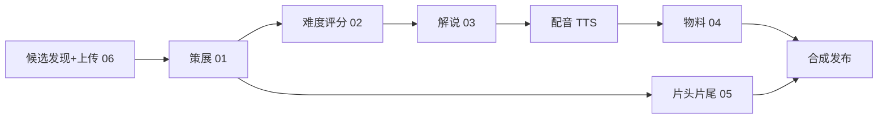

# bestdancer

「本周热舞」——面向跳舞初学者的 AI 热舞推荐与教学解说栏目。

## 定位

每周精选本周韩舞 + 抖音热舞 **TOP5**，外加 1 支「经典回归」旧舞；由 AI 生成教学解说（动作分解 + 难度星级）与年轻女声配音，首发 **抖音 / 小红书**。

**这是推荐 + 教学，可以下载少量的视频内容**：只要保留原作者水印，署名并附原链接即可。合规红线详见 [prompts/00-variables.md](prompts/00-variables.md)。

## 每期流程

1. **候选发现 & 上传**（[06](prompts/06-trend-brief.md)）：抖音 / 小红书反爬时不自动抓取——把热门候选链接 / 热榜丢给助理整理成清单，按 `<id>__<source>__<slug>.mp4` 命名下载到 `assets/incoming/<week>/`，跑 `python pipeline/intake.py <week>` 入库。经典回归从自有旧舞库（`classics_pool`）选。
2. **策展**（[01](prompts/01-curation.md)）：选 TOP5，排难度梯度，选 1 支经典回归。
3. **难度评分**（[02](prompts/02-difficulty-rubric.md)）：按 5 维 rubric 打分 → 1–5 星。
4. **教学解说**（[03](prompts/03-narration.md)）：每支 3–5 句（介绍 + 动作分解 + 适配建议）。
5. **配音**：年轻女声 TTS。
6. **发布物料**（[04](prompts/04-metadata.md)）：抖音 + 小红书 各自的标题 / 正文 / 封面 / 话题。
7. **合成**：片头 / 转场 / 片尾 / 经典回归卡（[05](prompts/05-intro-outro.md)）+ 星级角标 + 字幕。



## 目录结构

```
bestdancer/
├── README.md
├── .gitignore
├── prompts/                    # 各环节 prompt 模板(用 {变量} 占位)
│   ├── 00-variables.md         # 全局变量 + 合规红线(单一真源)
│   ├── 01-curation.md          # 策展/排序 + 经典回归
│   ├── 02-difficulty-rubric.md # 难度 1-5 星评分
│   ├── 03-narration.md         # 教学解说
│   ├── 04-metadata.md          # 抖音 + 小红书 发布物料
│   ├── 05-intro-outro.md       # 片头/转场/片尾 AI 生成
│   └── 06-trend-brief.md       # 候选发现/清单(人工上传版)
├── pipeline/
│   └── intake.py               # 扫描上传目录 -> 回填周配置候选
├── config/
│   └── weekly/                 # 每期一个 JSON(见 2026-W29.example.json)
└── assets/
    └── incoming/<week>/        # 人工下载的片段(命名 <id>__<source>__<slug>.mp4;被 gitignore)
```

## 状态

🚧 Prompt 与流程已定稿;采集与自动合成脚本待接入。后续计划见 [TODO.md](TODO.md)(含 OpenClaw / Hermes 自动采集路线)。

## License

待定。
