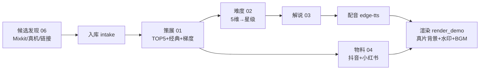

# 本周热舞 · 会话开发纪要

> **BestDancer** 独立个人品牌 · 面向跳舞初学者的 AI 热舞推荐栏目。
> 本文档总结本次会话从「一个想法」到「94 秒成片」的决策、架构与成果。

## 1. 定位

- **品牌**：BestDancer（独立个人品牌，自成体系，不与任何参考站联名/杂糅）。
- **栏目**：本周热舞 —— 面向**跳舞初学者**的「热舞推荐 + 教学解说」，不是搬运合集。
- **平台**：抖音 + 小红书，**9:16 竖版手机端**。
- **合规**：保留原作者水印 + 署名（`{credits}`）；不爬 YouTube / 抖音 / Instagram（违反 ToS + 版权）；如有侵权联系即删。

## 2. 关键决策（会话中逐步锁定）

| 项目 | 决定 |
|---|---|
| 每期结构 | 片头 → **TOP5** 新舞 → **1 支经典回归** → 合并片尾（谢谢观看 + 关注追更同一页） |
| 难度 | 5 维加权 rubric（速度/复杂度/控制/记忆/体能）→ **1–5 星** |
| 配音 | `edge-tts` 神经女声 **zh-CN-XiaoyiNeural**，语速 +18%（弃用机械的 SAPI） |
| 时长 | **~1.5 分钟**（每支取口播前 3 句控制节奏） |
| 素材来源 | **Mixkit** 免密钥合法下载（默认）/ Pexels（需免费 key）/ 抖音真机下载（规划） |
| BGM | **优先真片自带原声**，无音轨则用自制合成节拍 |
| 水印 | 圆形头像 logo（个人照裁 1:1 + 金边）+ `BestDancer`，右上角每帧常驻 |
| 简介固定尾部 | 接收投稿 · 北京随舞宣传报名 · 品牌合作 · 如有侵权请联系删除 |
| 品牌配色 | 底 `#0B0B14` / 品红 `#FF2E9A` / 青 `#16E0FF` / 星级黄 `#FFE14D` |

## 3. 目录结构

```
bestdancer/
├── README.md / TODO.md / .gitignore
├── prompts/                     # 各环节 prompt 模板（{变量} 占位）
│   ├── 00-variables.md          # 全局变量 + 合规红线 + 品牌/水印/简介尾部
│   ├── 01-curation.md           # 策展/排序 + 经典回归 + 难度梯度
│   ├── 02-difficulty-rubric.md  # 难度 1–5 星评分
│   ├── 03-narration.md          # 教学解说
│   ├── 04-metadata.md           # 抖音 + 小红书 发布物料（含 {FOOTER}）
│   ├── 05-intro-outro.md        # 片头/转场/片尾 AI 生成
│   └── 06-trend-brief.md        # 候选发现/清单（人工上传版）
├── pipeline/
│   ├── fetch_stock.py           # 抓合法真片（默认 Mixkit，可选 Pexels）
│   ├── intake.py                # 扫描上传目录 → 回填周配置候选
│   ├── render_demo.py           # 竖版成片渲染器（核心）
│   ├── make_bgm.py              # numpy 纯合成 BGM（零版权）
│   ├── make_logo.py             # 个人照裁 1:1 圆形 logo
│   └── tts_sapi.ps1             # SAPI 离线配音（edge-tts 失败时回退）
├── config/weekly/               # 每期一个 JSON（见 2026-W29.example.json）
├── brand/logo.png               # 品牌 logo（占位，gitignore 不入库）
├── assets/incoming/<week>/      # 真片素材（命名 <id>__<source>__<slug>.mp4）
└── output/                      # 成片 / 中间产物（gitignore）
```

## 4. 每期流程



## 5. 技术要点 / 踩坑

- **神经配音**：`edge-tts`（免密钥、连微软在线语音）替代机械拼接的 SAPI，自然度天差地别。
- **绿色 ffmpeg**：`imageio-ffmpeg` 自带 ffmpeg 二进制，无需安装系统级 ffmpeg / 管理员权限。
- **真片 BGM 回退**：`render_demo.seg_bed` 逐段判断——真片有音轨用其原声，无则用自制 BGM。Mixkit stock 多为无声，故 demo 走自制。
- **踩坑修复**：`seg_bed` 曾把上一轮残留的 bed wav 误判为“真片音轨”，加 `dst.unlink()` 清残留修复。
- **版式**：上下信息面板压矮 + 降不透明度，中间舞蹈区从 596px 扩到 780px（更突出真人舞蹈）。
- **水印**：`brand/logo.png` 圆形头像每帧 `alpha_composite` 到右上角，半透明不挡舞蹈。
- **竖版**：全程 720×1280（9:16），从不出宽屏。

## 6. 当前成果

- **成片**：[output/2026-W29_demo.mp4](../output/2026-W29_demo.mp4) —— 94 秒、晓伊配音、5 支真人舞蹈背景、logo 水印、合并片尾、自制 BGM。
- **示例配置**：[config/weekly/2026-W29.example.json](../config/weekly/2026-W29.example.json) —— 一期完整数据（含生成好的解说与抖音/小红书物料，均为虚构占位）。

## 7. 常用命令

```powershell
python pipeline/fetch_stock.py 2026-W29                 # 抓真片（默认 Mixkit 免密钥）
python pipeline/make_logo.py "C:\path\个人.png"         # 生成/更换 logo
python pipeline/render_demo.py 2026-W29                 # 渲染成片
$env:TTS_VOICE="zh-CN-XiaoxiaoNeural"; $env:TTS_RATE="+20%"   # 换音色/语速
```

## 8. 待办（详见 [TODO.md](../TODO.md)）

- **自动采集**：OpenClaw / Hermes 定时按关键词搜索 → 点赞排名 → 真机抖音下载（自带原曲 BGM）。
- **视觉**：真 logo / 卡通形象、转场与经典回归卡动效、真片多段精剪、BGM 侧链闪避。
- **运营**：投稿渠道 / 北京随舞报名落地页 / 品牌合作报价 / 侵权 SOP；`{contact}`、`{credits}` 回填。
